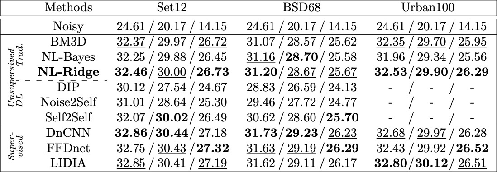

# Towards a unified view of unsupervised non-local methods for image denoising: the NL-Ridge approach
Sébastien Herbreteau and Charles Kervrann

## Requirements

Here is the list of libraries you need to install to execute the code:
* Python 3.8
* Pytorch 1.12.0
* Numpy 1.21.2
* Skimage 0.19.2

## Install

To install in an environment using pip:

```
python -m venv .nlridge_env
source .nlridge_env/bin/activate
pip install /path/to/NL-Ridge
```

## Demo

To denoise an image with NL-Ridge (remove ``--add_noise`` if it is already noisy):
```
python ./demo.py --sigma 15 --add_noise --in ./test_images/barbara.png --out ./denoised.png
```

## Results

### Gray denoising
The average PSNR (dB) results of different methods on various datasets corrupted with Gaussian noise (sigma=15, 25 and 50). Best performance among each category is in bold. Second best is underlined.




The average PSNR (dB) results of NL-Ridge on Set12 dataset corrupted with additive white Gaussian noise.

| sigma |  2 | 5 | 10 | 15 | 20 | 25 | 35 | 50 |
|---------|:-------:|:--------:|:--------:|:--------:|:--------:|:--------:|:--------:|:--------:|
|  PSNR | 43.81 | 38.19 | 34.50 | 32.46 | 31.06 | 30.00 | 28.41 |  26.73 |

### Complexity
We want to emphasize that  NL-Ridge is relatively fast. We report here the execution times of different algorithms. It is
provided for information purposes only, as the implementation, the language used and the machine on which the code is run, highly influence the  results. The CPU used is a 2,3 GHz Intel Core i7 and the GPU is a GeForce RTX 2080 Ti. NL-Ridge has been entirely written in Python with Pytorch so it can run on GPU unlike its traditional counterparts. 


Running time (in seconds) of different methods on images of size 256x256. Run times are given on CPU and GPU if available.

| | BM3D | NL-Bayes | NL-Ridge | Self2Self | DnCNN | LIDIA |
|---------|:-------:|:--------:|:--------:|:--------:|:--------:|:--------:|
|  CPU | 1.68 | 0.21 | 1.45 | n/a | 0.87 | 21.08|
|  GPU | n/a | n/a | 0.162 | 3877 | 0.007 | 1.184|


## Acknowledgements

This work was supported by Bpifrance agency (funding) through the LiChIE contract. Computations  were performed on the Inria Rennes computing grid facilities partly funded by France-BioImaging infrastructure (French National Research Agency - ANR-10-INBS-04-07, “Investments for the future”).
